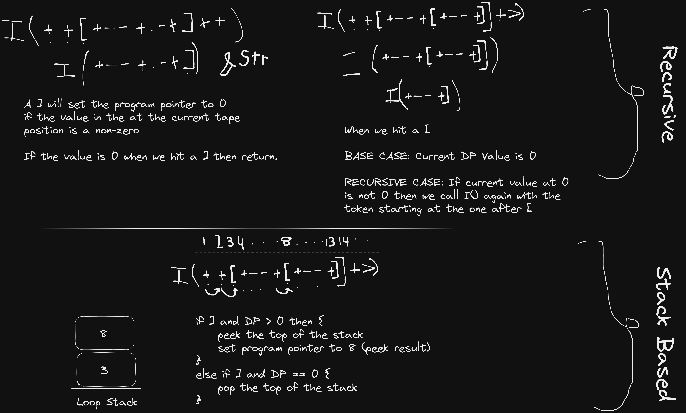

# brainy-rust
A Rust Based Brain Fuck Interpreter. 

## Features
1. Lexer.rs which [tokenizes](https://en.wikipedia.org/wiki/Lexical_analysis) the file
2. stack.rs an bare bones implemetation of a stack for the looping implementation
3. Main.rs Interpreter and Parser

> Note: This implementation doesn't use an AST hence we don't syntax check we only check for invalid tokens. If you do not open a loop just close it, the interperter will bring you up on it because there was no relevant [. Using an unclosed [ just pushes on the stack the program just keeps going without iteration. Maybe in the future I will check for unhandled data on the loop stack. 

## New Tokens 
### The # Token
This lets you output the current value as a number rather than interpreting it as a character like what brainfuck does.
Generally you would have to set the current value on the tape to the ascii value for the number you want, whereas this little addition lets you just dump the numeric value:
```brainfuck
+++++#
```
* Works exactly like `.` except doesn't interpret as an ASCII character.

### Bitwise Operations
You can now use bitwise operations more easily, the operations **allocate memory** and the result is stored in the the next,
slot on the tape. If there is no space it will segfault. 
The primary reason is, I found that sometimes you may need the operand values later, so I opted to not overwrite it.
> Note: in this case 'allocating memory' simply means the another slot of the tape is used rather than using an inplace operation.

**AND**
```bf
++++>++++++&#
```
output is the value of the operation `4&6` which is 4.

**OR**
```brainfuck
++++>+++++|#
```
The result is the value of `4|5` which is 5.

**NOT**
```brainfuck
+++++++!#
```
This will output the complement of 7 hence the result is result is -8.
| Note: NOT is a unary operation so doesn't require a second operand. 

| Note: we don't need to move to the next call by calling `>` after the bitwise operation, because the operators increment the current pointer themseves. You have to call `<` if you wanted the value of the second operand after the operation has completed.

## Dealing with Loops \[ and \] 
I had two solutions 

